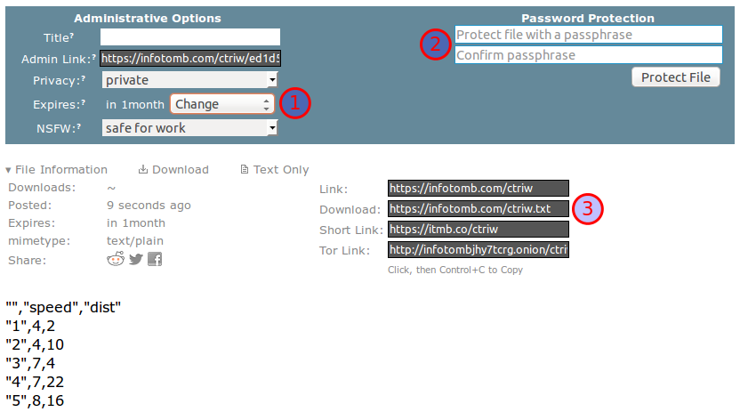
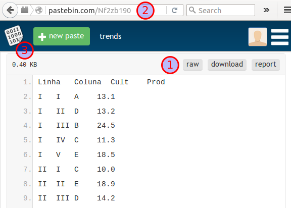
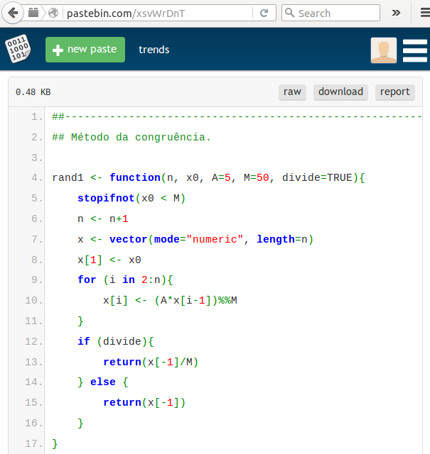
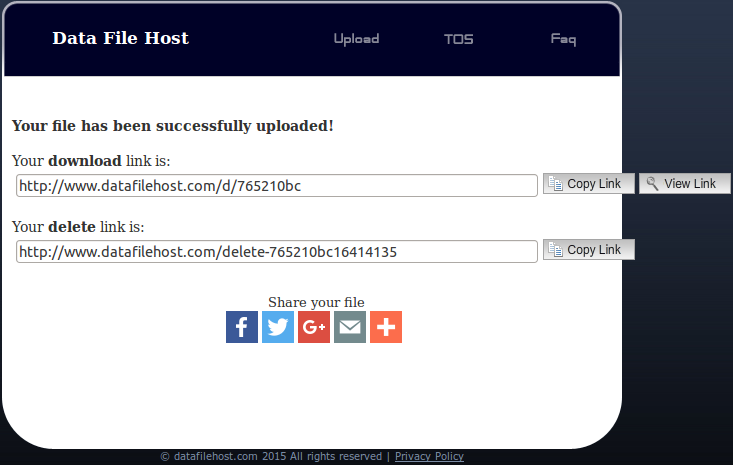
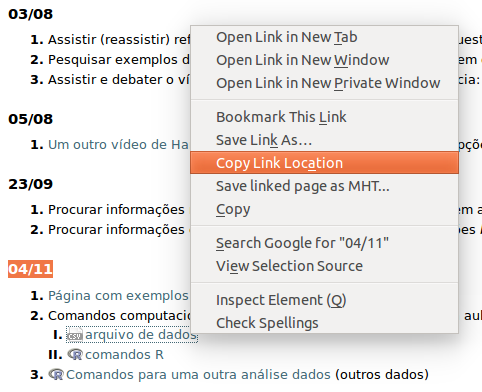

---
output:
  html_document:
    keep_md: true
---

# Como fazer Código Mínimo Reproduzível

## Objetivos ##

Nunca envie anexos!

O objetivos desse documento são ilustrar opções para gerar código mínimo
reproduvível.

## CMR autocontida ##

Aqui a mensagem contém os dados, sem precisar de terceiros.

### Exportanto para texto ###

A função `dput()` escreve a presentação em modo texto de objetos no
*console* (*output*). Com essa representação em texto de um objeto, você
pode recriá-lo integralmente, basta recortar o resultado do *console* e
colar no *script*.

A função `dump()`, no entanto, é mais aconselhada para transferir
objetos entre sessões R. A diferença é
que a `dump()` permite exportar vários objetos e não escreve o resultado
no console, mas num arquivo `.R`, o que é conveninete pois pode-se usar
o `source()` para recriar os objetos.

Usar essas duas funções para disponibilar dados em correios é algo muito
simples. Abaixo estão formas de usá-las. Note que a seleção das
primeiras linhas dos *data.frames* é apenas para evitar *outputs*
extensos nesse guia.

```{r}
## Comportamento default.
dput(iris[1:5, ])

## Não exporta os atributos e fatores.
dput(iris[1:5, ], control=NULL)

## Mais um exemplo.
dput(mtcars[1:5, ])

## Cria um arquivo dumpdata.R com dois objetos exportados
x <- iris[1:5, ]
y <- mtcars[1:5, ]
dump(c("x", "y"))

## Exibe o conteúdo do arquivo.
system("cat dumpdata.R")

## Limpa o ambiente de trabalho.
rm(list=ls())

## Carrega o arquivo com os objetos exportados.
source("dumpdata.R")

## Tcharam! Objetos recriados.
ls()

```

Como já mencionado, tanto usando `dput()` quanto `dump()`, você deve
enviar no seu correio essa saída modo texto. Então será preciso,
logicamente, recortar (do console ou do arquivo `.R`), e colar na
mensagem. Não se esqueça de atribuir a um objeto. Segue abaixo um
exemplo 

```
Pessoal, eu tenho um conjunto de dados e quando vou calcular a média
recebo NA como resultado. O que eu preciso fazer para ter resultados
numéricos?

##-------------------------------------------
## Meu CMR.

dados <- 
structure(list(mpg = c(NA, 21, 22.8, 21.4, 18.7), cyl = c(6, 
6, 4, 6, 8), disp = c(160, 160, 108, 258, 360), hp = c(110, 110, 
93, 110, 175), drat = c(NA, 3.9, 3.85, 3.08, 3.15), wt = c(2.62, 
2.875, 2.32, 3.215, 3.44), qsec = c(16.46, 17.02, 18.61, 19.44, 
17.02), vs = c(0, 0, 1, 1, 0), am = c(1, 1, 1, 0, 0), gear = c(4, 
4, 4, 3, 3), carb = c(4, 4, 1, 1, 2)), .Names = c("mpg", "cyl", 
"disp", "hp", "drat", "wt", "qsec", "vs", "am", "gear", "carb"
), row.names = c("Mazda RX4", "Mazda RX4 Wag", "Datsun 710", 
"Hornet 4 Drive", "Hornet Sportabout"), class = "data.frame")

str(dados)

mean(dados$mpg) ## Dá NA.
mean(dados$cyl) ## Ok.

##-------------------------------------------

Grato pela atenção.
Joselito.

```

Algumas recomendações:

**Evite remover os atributos**

Quando você exporta um *data.frame* e usa `control=NULL` o que você
recebe é uma lista e os fatores passam ser númericos além de outros
efeitos causados pela "simplificação". Nesse caso é simples explicar. Um
*data.frame* é uma lista onde todos os elementos são vetores (ou
matrizes) de mesmo comprimento e um fator são número inteiros com
rótulos indicando o nome do nível, para ser bem simplista. Então, ao
remover os atributos, você faz a representação mínima desses elementos.
     
```{r}
## x <- iris[1:5, ]
## dput(x)
## dput(x, control=NULL)

x <- 
structure(list(Sepal.Length = c(5.1, 4.9, 4.7, 4.6, 5), Sepal.Width = c(3.5, 
3, 3.2, 3.1, 3.6), Petal.Length = c(1.4, 1.4, 1.3, 1.5, 1.4), 
    Petal.Width = c(0.2, 0.2, 0.2, 0.2, 0.2), Species = structure(c(1L, 
    1L, 1L, 1L, 1L), .Label = c("setosa", "versicolor", "virginica"
    ), class = "factor")), .Names = c("Sepal.Length", "Sepal.Width", 
"Petal.Length", "Petal.Width", "Species"), row.names = c(NA, 
5L), class = "data.frame")

y <- 
list(Sepal.Length = c(5.1, 4.9, 4.7, 4.6, 5), Sepal.Width = c(3.5, 
3, 3.2, 3.1, 3.6), Petal.Length = c(1.4, 1.4, 1.3, 1.5, 1.4), 
    Petal.Width = c(0.2, 0.2, 0.2, 0.2, 0.2), Species = c(1, 
    1, 1, 1, 1))

str(x)
str(y)
```

**Procure enviar só o necessário**

Não é raro você estar analisando um conjunto de dados de 1000 linhas mas
poder reduzir ele para 30 e ainda rodar o código, certo? Nesse caso, é
melhor que você envie a menor represetação dos dados capaz de ilustrar o
seu problema. Muitos serviços de email, principalmente de listas de
discussão, não enviam mensagem com um corpo grande. Então, sua mensagem
corre o risco de não chegar aos destinatários.

Da mesma forma, envie apenas as colunas necessárias para o seu caso. Se
o seus dados tem 50 colunas mas o problema só considerar as 3 primeiras
colunas, então exporte apenas estas.

**Arredonde valores para encurtar a saída**

Colunas de números não inteiros são exportadas com a precisão de
registro das variáveis. Com isso, na saída você pode ter muitas casas
decimais, geralmente desnecessárias pro problema em questão.

```{r}
x <- matrix(rnorm(20), ncol=2)

## Com a precisão original.
dput(x)

## Arredondamento para 2 casas.
dput(round(x, 2))

```

**Ao indentar/editar, preserve**

Se for indentar essa saída, embora não seja necessário, tome cuidado
para preservar o conteúdo. Certas pessoas têm o hábito de sempre
indentar porque valorizam os benefícios disso, facilita a compreensão do
código. No entanto, ao editar essa saída seja cuidadoso pois vírgulas,
aspas, parenteses, podem ser removidos sem querer, assim como outros
dados. Sempre após editar, confira se os dados são recuparados sem
erros. Perceba também que ao indentar o código fica mais extenso, mais
vertical.

```{r, eval=FALSE}
## dput(iris[1:5, ])

## Sem indentar.
x <- 
structure(list(Sepal.Length = c(5.1, 4.9, 4.7, 4.6, 5), Sepal.Width = c(3.5, 
3, 3.2, 3.1, 3.6), Petal.Length = c(1.4, 1.4, 1.3, 1.5, 1.4), 
    Petal.Width = c(0.2, 0.2, 0.2, 0.2, 0.2), Species = structure(c(1L, 
    1L, 1L, 1L, 1L), .Label = c("setosa", "versicolor", "virginica"
    ), class = "factor")), .Names = c("Sepal.Length", "Sepal.Width", 
"Petal.Length", "Petal.Width", "Species"), row.names = c(NA, 
5L), class = "data.frame")

## Indentado.
x <- 
    structure(
        list(Sepal.Length = c(5.1, 4.9, 4.7, 4.6, 5),
             Sepal.Width = c(3.5, 3, 3.2, 3.1, 3.6),
             Petal.Length = c(1.4, 1.4, 1.3, 1.5, 1.4), 
             Petal.Width = c(0.2, 0.2, 0.2, 0.2, 0.2),
             Species = structure(
                 c(1L, 1L, 1L, 1L, 1L),
                 .Label = c("setosa", "versicolor", "virginica"),
                 class = "factor")),
        .Names = c("Sepal.Length", "Sepal.Width", "Petal.Length",
                   "Petal.Width", "Species"),
        row.names = c(NA, 5L),
        class = "data.frame")

```

### Gerando valores

Um dos tipos de mensagem mais comuns é aquele em que a pessoa quer
aplicar um procedimento à um conjunto de dados de estrutura
definida. Por exemplo, 1) extrair a média para todas as colunas de uma
tabela, 2) filtrar uma tabela mantendo apenas linhas onde o valor de uma
variável é maior que 10, 3) ...

O que esses exemplos têm em comum? Que o foco é o processo e não os
dados. Se qualquer dado é valido, porque não simular?

```{r}
## Gerar uma matriz 10x5 de números aleatórios.
m <- matrix(10*5, nrow=10, ncol=5)

## Gerar dados conforme um experimento de blocos completos, b=5 e t=3.
da <- expand.grid(bloc=gl(n=5, k=1),
                  trt=gl(n=3, k=1, labels=c("A", "B", "C")),
                  KEEP.OUT.ATTRS=FALSE)
da$y <- rnorm(nrow(da))
str(da)

```

Para situações como essa, as funções de geração de números aleatórios,
sequencias regulares, e estruturas regulares são fundamentais.

**Números aleatórios**

O pacote `stats` do R, presente em qualquer sessão, contém funções para
ferar números aleatórios das distribuições de probabilidade mais
conhecidas. Segue na tabela abaixo a relação dessas funções. Consulte
<http://www.r-tutor.com/elementary-statistics/probability-distributions>
e <http://www.stat.umn.edu/geyer/old/5101/rlook.html> para mais detalhes
e aplicações.

```{r, echo=FALSE, results="as.is"}
## Reração de números aleatórios.
## dput((grep(pattern="^r.*$", ls("package:stats"), value=TRUE)))

x <- c("rbeta", "rbinom", "rcauchy", "rchisq", "rexp", "rf", "rgamma",
       "rgeom", "rhyper", "rlnorm", "rlogis", "rmultinom", "rnbinom",
       "rnorm", "rpois", "rsignrank", "rstandard", "rstudent", "rt",
       "runif", "rweibull", "rwilcox", "rWishart")
ncol <- 5
length(x) <- ((length(x)%/%ncol)+1)*ncol
x[is.na(x)] <- ""
m <- as.data.frame(matrix(x, ncol=ncol), stringsAsFactors=FALSE)

knitr::kable(m, row.names=FALSE, col.names=1:ncol)

```

A função `sample()` faz amostras aleatórias, com reposição ou não, de um
vetor de valores passados.

```{r}
L <- LETTERS[1:5]
sample(L)
sample(L, size=3)
sample(L, size=10, replace=TRUE)

## 5 repetições de uma amostragem sem reposição de tamanho 3.
replicate(n=5, expr=sample(L, size=3))
```

**Sequências regulares**

As funções `seq()` e `rep()` podem ser usadas para gerar sequências
regulares. Quando combinadas, diversos padrões podem ser obtidos. Alguns
exemplos de uso estão disponíveis abaixo.

```{r}
##-------------------------------------------
## Sequências.

## Começa em 4, não ultrapassa 40, têm incremento 8.
seq(from=4, to=40, by=8)

## De -5 à 5 com 11 valores.
seq(from=-5, to=5, length.out=11)

## De 0 com incremento 0.2 até obter 10 valores.
seq(from=0, by=0.2, length.out=10)

##-------------------------------------------
## Com datas.

## A seq() chama a seq.Date() quando objetos são datas.
seq.Date(from=as.Date("2016-02-01"),
         to=as.Date("2016-02-05"),
         by="day")

seq(from=as.Date("2016-02-01"),
    to=as.Date("2016-02-05"),
    by="2 days")

seq(from=as.Date("2016-02-01"),
    to=as.Date("2016-04-01"),
    by="2 weeks")

seq(from=as.Date("2016-02-01"),
    to=as.Date("2016-12-31"),
    by="3 months")

seq(from=as.POSIXct("2016-02-01 00:00:00"),
    to=as.POSIXct("2016-02-01 00:30:00"),
    by="5 mins")

##-------------------------------------------
## Repetições.

## Repete o vetor 5 vezes.
rep(1:3, times=5)

## Repete cada elemento 5 vezes.
rep(1:3, each=5)
rep(rep(letters[1:3], each=2), times=3)

```

**Estruturas regulares**

A função `expand.grid()` gera combinações cartesianas. ... FIXME

```{r}
da <- expand.grid(A=1:3, B=c(10, 20), C=c("A", "B"))
da

```

Pacote Algdesign, FrF2 para delineamentos.

****
## Hospedando os dados ##

Quando o problema endereçado não pode ser resolvido com dados dentro da
mensagem ou vindos de simulação ou quando o problema é na realidade dado
dependente (mas não grandes) você pode (e deve) hospedar em algum lugar
público. **Jamais envie dados anexados na mensagem**.

Vivemos cheios de alternativas que permitem hospedar arquivos na nuvem
com acesso à outras pessoas. 

**Dropbox**

O <http://dropbox.com/> é o serviço de sincronização de arquivos e
espaço na núvem mais conhecido que existe. No diretório Dropbox um
diretório chamado `Public/`. Como sugere, o seu conteúdo é
público. Chique com o botão direito sobre algum arquivo dentro da `Public/` para
pegar o link de acesso (`Dropbox > Copy Public Link`). Envie esse link
para seus destinatários. O arquivo pode ser qualquer coisa.

No nosso caso, podemos hospedar um arquivo `.txt` (`.csv`, `.R`,
`.RData`) e ler de dentro de uma sessão R. Para exemplificar, nesse
diretório tem um arquivo chamado `How to use the Public folder.txt` que
informa como usar o recurso. Vou pegar o link desse arquivo e ler com o
R.

```{r}
url <-
    "https://dl.dropboxusercontent.com/u/48140237/How%20to%20use%20the%20Public%20folder.txt"
da <- readLines(url, encoding="UTF-8")

## Para exibir o texto sem ultrapassar 60 digitos por linha.
cat(unlist(lapply(da, FUN=strwrap, width=60)), sep="\n")
```

Repare na url. Note que `u/48140237/` identifica o usuário, no caso
eu. Todas os arquivos da minha `Public/` terão o mesmo prefixo, o que
vai mudar na url é o nome do arquivo, obviamente.

Como diz o texto, existem apenas links para arquivos, e não para
diretórios. Caso precise enviar muitos arquivos, faça um arquivo
compactado com eles (um `.zip`, `.rar`, etc).

Embora não se possa descobrir quem é o usuário correspondente a um link
e também não seja possível ver todo o conteúdo do `Public/` pelo prefixo
da url, muitos não se sentem confortáveis em usar a `Public/` para
compartilhar arquivos. Preferem algo (supostamente) mais anônimo ou
seguro.

*Importante*: No seu CMR já use a url dentro de uma função de leitura,
como as `read*()`, `source()`, `load()`, `download.file()`, etc,
conforme for a necessidade. Evite de fazer seu colaborador abrir o
endereço no navegador e se dar o trabalho de baixar, salvar, enfim. É
sempre recomendável que você indique o *encoding* durante a leitura.

Mais sobre a `Public/` você encontra em
[What is the Public folder for?](https://www.dropbox.com/en/help/16)

Outros serviços têm recursos semelhantes ao Dropbox. Um que conheci
recentemente, mas que não uso, é o <https://www.copy.com/>. O plano
*free* oferece 15 GB enquanto que o Dropbox só 2 GB e existe versões do
serviço para smartfones e tablets.

**Infotomb**

Infotomb (<https://infotomb.com/>) é um repositório de arquivos
anônimo. Não só arquivos de textos podem ser compartilhados pelo
serviço, mas qualquer outro formato (jgp, pdf, csv, etc). Os arquivos
tem um tempo de vida que pode ser definido (1) após o upload. Também é
possível atribuir senha aos arquivos (2) para restringir o acesso. O
mais interessante, no entanto, é que o arquivo e pode ser lido
diretamente pela url (3).



Muitos serviços de hospedagem não dão uma url que permite a leitura do
arquivo, apenas dão um link que abre uma caixa de download para clica em
OK e baixar. Parece exagero de preocupação mas com a url para ler direto
tudo é mais fácil, são menos etapas, se resolve na sessão R. Com botão
de download é preciso salvar o arquivo, mudar o diretório de trabalho,
ler e depois lembrar de deletar quando não for mais necessário.

```{r, eval=FALSE}
url <- "https://infotomb.com/ctriw.txt"
da <- read.csv(url)
str(da)
```
```
## 'data.frame':	50 obs. of  3 variables:
##  $ X    : int  1 2 3 4 5 6 7 8 9 10 ...
##  $ speed: int  4 4 7 7 8 9 10 10 10 11 ...
##  $ dist : int  2 10 4 22 16 10 18 26 34 17 ...
```

**Pastebin**

O <http://pastebin.com/> permite envio apenas de texto, diferente do
anterior, que permite upload de qualquer arquivo. O pastebin nem tem
botão de upload. O texto (seus dados ou código) precisa ser colados na
caixa de texto. Isso porque o pastebin é mais usado para trocar
fragmentos de código e não de dados, geralmente arquivos com muitas
linhas. Inclusive, pensando em código, o pastebin tem recurso de *sintax
highlight* justamente para facilitar a leitura do código
compartilhado.

No pastebin, assim como o anterior, os dados possuem uma url da qual
podem ser lidos. Você não precisa ter uma conta (mas pode fazer uma) e
pode controlar o tempo de expiração também. Para pegar a url de
download, copie da barra de endereços o que aparecer quando você clicar
em `raw` e use para ler os dados (ou carregar *script*). Quando você
clica no botão `raw` (1), o endereço exibido (2) ganha um `raw/` no
meio. Os dados exibidos na figura são carregados da mesma forma.

```{r, eval=FALSE}
url <- "http://pastebin.com/raw/Nf2zb190"
da <- read.table(url, header=TRUE, sep="\t")
str(da)
```
```
'data.frame':	25 obs. of  4 variables:
 $ Linha : Factor w/ 5 levels "I","II","III",..: 1 1 1 1 1 2 2 2 2 2 ...
 $ Coluna: Factor w/ 5 levels "I","II","III",..: 1 2 3 4 5 1 2 3 4 5 ...
 $ Cult  : Factor w/ 5 levels "A","B","C","D",..: 1 4 2 3 5 3 5 4 2 1 ...
 $ Prod  : num  13.1 13.2 24.5 11.3 18.5 10 18.9 14.2 23 15 ...
```



Funções podem ter código renderizado.



**Data File Host**

No <http://www.datafilehost.com/> você sobe o arquivo e a url para
download é gerada. Diferente dos dois anteriores, não é dada url para
download direto e sim uma caixa de diálogo com botão de download. Não
tem como fazer conta e os arquivos são removidos quando ultrapassam 90
dias sem download.



Comparado às soluções já apresentadas, o Data File Host é menos
interessante por não er url de download.

**GitHub, GitLab e outros**

Pegar o raw do arquivo, como esse
https://raw.githubusercontent.com/walmes/emacs/master/dotemacs.el.

**Google Drive, One Drive**

<https://onedrive.live.com/> não tem para Linux. Sky ou One drive?
<https://www.google.com/drive/> não gera link público, só permite
compartilhar com pessoas, requer conta google.

**Wikis e Blogs**

Se você tem acesso (é dono) de blog ou tem uma wiki, até mesmo um
moodle, essa é uma opção interessante.

http://www.leg.ufpr.br/doku.php/disciplinas:ce003ko-2015-02:historico
dia 04/11

```{r, eval=FALSE}
url <- "http://www.leg.ufpr.br/lib/exe/fetch.php/disciplinas:ce003ko-2015-02:ce003-201101.csv"
da <- read.csv2(url)

```



**Text Uploader**

<http://textuploader.com> Compartilhar snippets, não requer conta, mas a
pessoa teria que recortar. Tem highligths.

```{r, eval=FALSE, include=FALSE}
## Isso não é viável.
library(XML)

x <- readLines("http://textuploader.com/5f97k")
h <- htmlTreeParse(file=x, asText=TRUE,
                   useInternalNodes=TRUE, encoding="utf-8")
summary(h)
getNodeSet(doc=h, path="//code[@class]", fun=xmlValue)

readLines("https://m.uploadedit.com/ba3n/1450876813762.csv")

readLines("http://www.datafilehost.com/get.php?file=f080fcba")

```

### Usando `read.*` ###

Hospeda os dados em local público e lê pela url.

### Usando `download.file` ###

Hospeda os dados em local público e lê pela url.

### Usando `source` ###

Pode ser para ler saídas do `dput()` ou carregar funções externas.

### Usando `load` ###

Isso puxa um `RData` que pode ter objetos de dados.

## Cuidados com relação aos pacotes e sessão

Informações da sessão, sistema operacional e pacotes no topo. Encoding,
tempo de execussão.

Uso de comentários e indentação.
